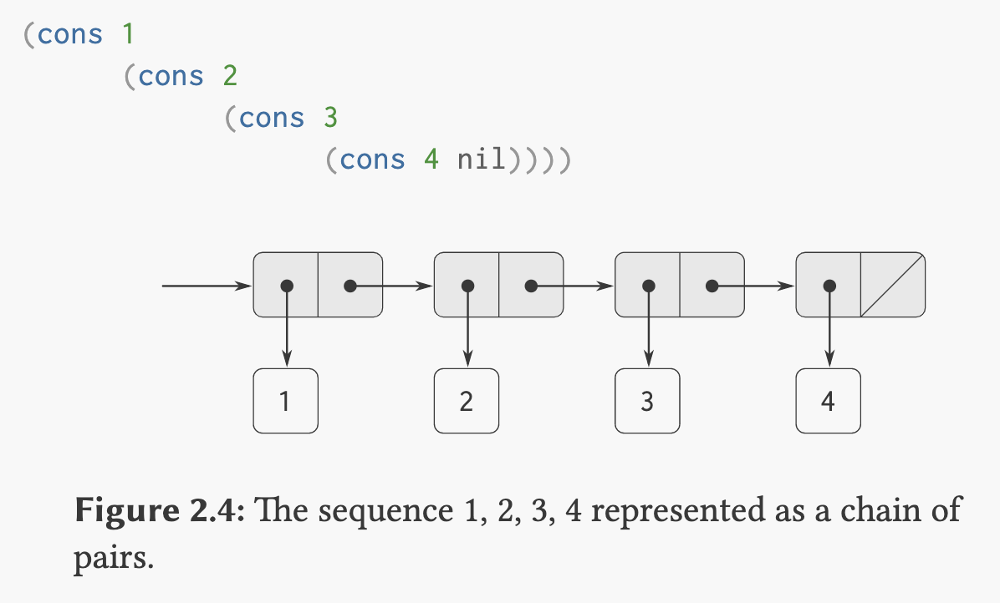
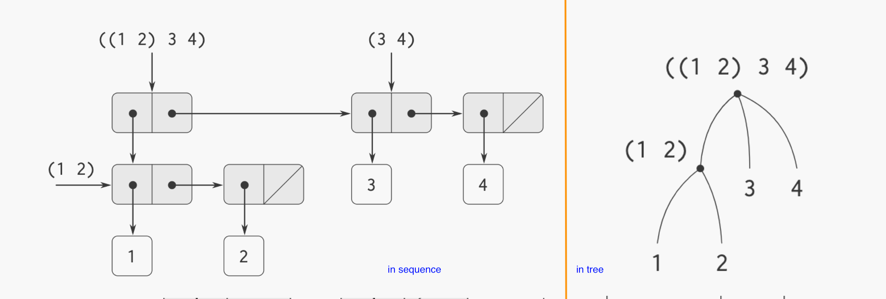
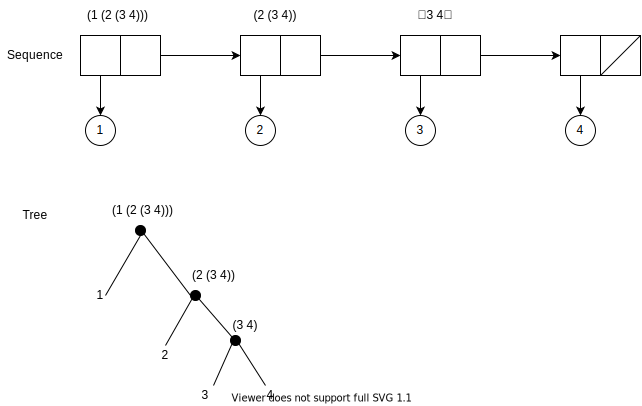

# 2. Abstraction of **data**
##### Why we need compound data ?
- higher conceptual level of data
- increase the **modularity** => separate the *representation* of data & the *use* of data

##### key idea of providing a glue to form compound data:
- *closure*
- compound data objects serve as conventional *interfaces* => 被抽象好的data objects可以作为上一层program的基本操作，即每一层都只需要知道它可以使用的操作，而不需要关心implementation的细节，因此这些data objects可以被看作是一个interface, 例如在计算有理数时的结构，最上层使用rational number的时候，只需要知道哪些*rational number*可以被拿来用，同时可用的*methods*有哪些就行，至于有理数如何构建，add/sub如何实现，都不用在意：


**wishful thinking** => if sth is not there, let’s assume it’s already there 👀

The single compound-data primitive `pair`, implemented by the procedures `cons` (*constructor*), `car`(*Contents of Address part of Register*), and `cdr`(*Contents of Decrement part of Register*), is the only glue we need. Data objects constructed from pairs are called **list-structured data**.

##### 关于程序设计的Gotcha:
- 在构建有理数时，我们可以把两个部分（numerator and denominator）除以最大公约数（gcd）这一步骤放在constructor (`make-rat`) 里，也可以放在selector (`numer`/`denom`) 里。如何放置则完全取决于之后我们想要如何使用这个东西，例如之后我们如果需要频繁access有理数的分子/分母，那么最好放在constructor里，这样就不用每次access(select)的时候再计算一遍。
- 而data abstraction的好处是，如上图所示，每一层的应用都跟下一层的具体细节无关，因此如果在设计`make-rat`/`numer`/`denom`时我们还无法确定到底把dived by gcd这步放在哪里，也完全没关系，随便选一个，之后修改时也只需要修改这层，而其他应用这层的program都不需要改动，即data abstration gives us the ability to defer the decision later.

#### So, what is data?
Data can be defined by some collection of **constructors** and **selectors**, together with **specified conditions** that there procedures must fulfill, in order to be a validated representation.

*Ex*: 在构建有理数的data时，我们有constructor => `(cons a b)`, 以及selectors (numer => `(car x)`, denom => `(cdr x)`), 则一个有效的有理数data必须满足的specified conditions（约束条件）是，`(numer x)/(denom x) = a / b`

以这个条件来思考，我们使用的`cons`, `car`, `cdr`也是一组只需要满足特定条件的collection: 
```scheme
; Amazing example to explain the "data"
; by demonstrate how we can define a data type
; using only procedures
(define (cons x y)
  (define (dispatch m)
    (cond ((= m 0) x)
          ((= m 1) y)
          (else (error "aguments is neither 0 or 1---CONS" m))
    )
  )
  ; note here we return a procedure called `dispatch` in constructor
)

(define (car z) (z 0))

(define (cdr z) (z 1))
```
这样我们的*constructor*返回一个procedure, 所以在使用*selectors*时，例如`(car (cons 2 3))`, 因为`(cons 2 3)`返回的是一个名为dispatch的procedure, who takes a simple param `m`, and return value accordingly. 而我们指定car为*向这个返回的procedure传入0*， 则根据上面dispatch的定义，我们会得到`x`，同理`cdr`会得到`y`.

`m`在此处可以是任何boolean的条件。

用procedure来represent data这种编程方式，被称作 **message passing**，我们可以很容易从这一方式里得到我们的model (cool…).

## Hierarchical Data with Closure
Pair是我们用来构建所有data structure的building block. 我们也可以创建指向另一个pair的pair，因此理论上可以以此represent所有的data structure.

这种pair里可以包含另外的pairs的能力(即只要一个operation所combine出来的结果可以继续被同样的operation所combine)，被称为 **closure property**. 这一特性让我们可以创造hierarchical data structure.

比如使用pairs,我们可以用此来表示 *sequences* 和 *trees*.

### Sequences (or `list`)
Sequence is an ordered collection of data objects.

Using pairs (`cons`, `car`, `cdr`), we can represent a number sequence (1, 2, 3, 4) as a chain of pairs, where each of the `car` is the corresponding number, and the `cdr` is a pointer to the next pair in the chain.



So we got a `list`. Which is a primitive in Scheme, we can simplify the `cons`es as `(list 1 2 3 4)`. And if we try to do `(cdr (list 1 2 3 4))`, we'll get a sublist that consists of all but the first item (so typical `head` & `tails`). And the `nil` used to terminate the sequence, can be thought as the *empty list*.

#### => list operations
##### **`cdr`ing down** ( what a name 😂 ).

```scheme
; get the nth element of a list
(define (list-ref list n)
  (if (= n 0)
    (car list)
    (list-ref (cdr list) (- n 1))
  )
)

; calculate the length of a list
; `null?` is a primitive to test whether its argument is the empty list
(define (length list)
  (define (length-iter a count)
    (if (null? a)
      count
      (length-iter (cdr a) (+ 1 count))
    )
  )
  (length-iter list 0)
)
```

##### **`cons` up** while **`cdr`ing down**.

```scheme
; append a list to another list
(define (append list1 list2)
  (if (null? list1)
    list2
    (cons (car list1) (append (cdr list1) list2))
  )
)
```

#### => Mapping over the list
##### Apply some transformation to each element in a list

```scheme
(define (map procedure list)
  (if (null? list)
    ()
    (cons (procedure (car list)) (map procedure (cdr list)))
  )
)
```

`map` as a higher order procedure allows us to draw our attention from detailed element-by-element process to tranforming a list of elements to a list of results. 

We can see it as an **abstract interface** which gives us a *flexibility* to change the low-level details (like how a sequence is constructed) without changing the conceptual operations they can apply. 

See also the [for-each](sicp2-2.scm) implemented in exercise 2.23


### Tree (Hierarchical structure)

The same list `((1 2) 3 4)` can be represented either as a sequence or a tree.



#### => tree operations
If we use the `length` procedure above on this list ( so we treat the list as a sequence )

```scheme
(define x (cons (list 1 2) (list 3 4)))

(length x) ;3

(count-leaves x) ;4

(length (list x x)) ;2

(count-leaves (list x x)) ;8
```

We can define a `count-leaves` with the similar technique as the `length` above, by using another primitive called `pair?` in scheme:

```scheme
; calculate the leaves of a list
; `pair?` is a primitive to test whether its argument is a pair

(define (count-leaves list)
  (define (iter a count)
    (if (null? a)
      count
      (if (pair? (car a))
        (iter (cdr a) (+ (count-leaves (car a)) count))
        (iter (cdr a) (+ 1 count))
      )
    )
  )
  (iter list 0)
)
```

Exercise 2.24: represent `(list 1 (list 2 (list 3 4)))` as sequence and tree

N.B. the answer for sequence is wrong.



