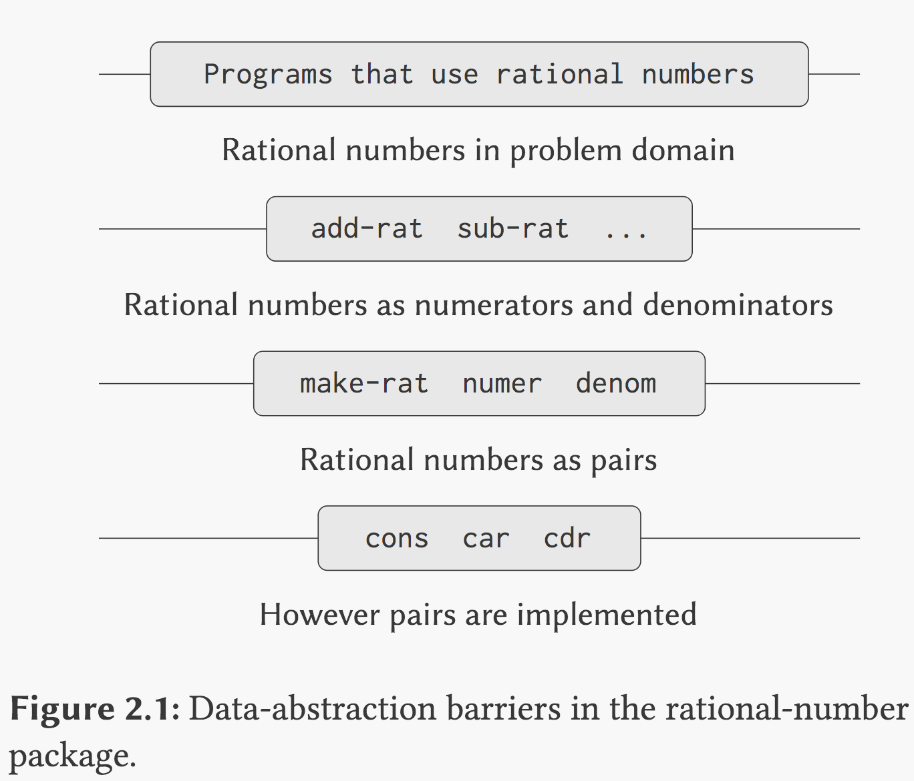

# link
- book: https://mitpress.mit.edu/sites/default/files/sicp/full-text/book/book.html
- 习题参考答案： http://community.schemewiki.org/?sicp-solutions
- the html5 version http://sarabander.github.io/sicp/html/index.xhtml

# 1. Abstraction of **procedure**
Advance of Lisp:
represent *procedures* as *data*

## How to define sth
### value
```scheme
(define x 5)
x
;x will be 5 in current env
```
### procedure (func if you like)
```scheme
(define (square x) (* x x))
;To square(name) something(x), multiply(*) it(x) by itself(x).
```
所以基本的逻辑是：
`(define (<name> <formal parameters>) <body>)`
- name是一个symbol，用来在当前环境下指代这个定义的procedure
- formal parameters是之后将要在这个procedure的body里用到的params的指代
- body里是一个expression，用于yield value，一旦往这个procedure里传入params所指代的值之后

然后就可以compound啦, EX: 
```scheme
(define (square_sum x y) (+ (square x) (square y)))
(define (f a) (square_sum (+ a 1) (* a 2)))
```
*Compound procedure* 的好处是，你自己定义的procedure跟语言内置的procedure可以毫无差别地使用， 例如上面这一行里的`square`以及`square_sum`.

##### 运行compound procedure的步骤， 例如 `(f 5)`: 
- **=> applicative-order evaluation (evaluate then apply, or, call by value):**
1. 找到这个procedure的body，然后代入supply的argument => body是`(square_sum (+ a 1) (* a 2))`， 代入`5`, 得到`(square_sum 6 10)`
2. 然后在env里找到`square_sum`这个procedure的body, `(+ (square x) (square y))`, 代入上一步的`6`和`10`， 变成`(+ (square 6) (square 10))`
3. 继续在env里找到`square`这个procedure的body, `( * x x)`, 再次substitute => 变为`(+ (* 6 6) (* 10 10))`
4. 下一步是找到内置的`*`这个procedure, 再substitue => 变为`(+ 36 100)` =>最后得到结果136
- **=> normal-order evaluation (fully expand then reduce, or, call by name):**
1. 先全部展开 =>
```scheme
(square_sum(+ 5 1) (* 5 2))
-> (+ (square (+ 5 1)) (square (* 5 2)))
-> (+ (* (+ 5 1) (+ 5 1)) (* (* 5 2) (* 5 2)))
```
2. 然后当展开到最后只剩primitive procedure的时候，一起计算

Lisp采用第一种**applicative-order**

- 因为可见第二种有可能需要重复计算
- 但第二种可以避免计算不必要的arguments.
- 考虑到termination, 只要在applicative-order evaluation中可以termination的procedure,就一定可以在normal-order evaluation中terminate,反过来则不成立。

这一过程称为 *substitution model for procedure application* .

但只是为了更好地理解运行过程，实际上一个编译器(interpreter)并不会运行这种substitution, 而是using a local environment for the formal parameters ？？？(TODO: **how?**)

##### <u>Take aways</u> from [exercises](sicp1-1.scm) :
```scheme
(define (a-plus-abs-b a b)
  ((if (> b 0) + -) a b))
```
注意看这个procedure! 甚至可以用conditional `if` 来决定operator到底是`+`还是`-`, 因为`+`和`-`说到底也只是内置的procedures. Wow!!!! conditional operator!!!!

>in JS:
>```js
>const aPlusAbsB = (a, b) => b >= 0 ? a+b : a-b; 
> ```
> 此处只能分别返回两种操作，而不能根据条件改变操作符 

## Differences between math function & computer procedures
大部分时候，math functions是 **declarative** 的（声明式），即 _describe the properties of things_，它只需要定义一个东西是什么

而computer procedures多半是 **imperative** 的（指令式），即 *tell how to do things*,它需要告诉如何去做一个东西。

（TODO: 但是目前很多人都说函数式是更加declarative的？）

##### 注意点：
- => **abstraction as black box**
我们可以把一段程序看作a cluster of procedures，就是把一堆procedure绑在一起。称为abstraction of procedures, 从外部调用时，我们不需要关心它的implementation details

- => **local names**
  在定义个procedure的时候，它的params names是使用者不需要关心的，即，params names are local to the procedure, 使用的时候你可以pass随便什么名字进去。

  因此，一个procedure的formal params也被称为  *bound variables*, 即这个procedure在定义的时候就binds了它自己的params. 如果一个param没有被绑定，我们认为它是 *free* 的。

  在procedure的body里，是这些被绑定的params被使用的地方，所以我们把body的这部分看作是这些bound variables的scope,即这些params的名字只有在这个scope里才是被refer的，在scope之外没人care...

- => **Internal definitions** (or localize sub-procedures)

  就是把一些sub procedures的定义放在body里面，不暴露给外界，我们也可以把它称之为block structure (nesting of definitions)。如下列中的***所有**defs inside sqrt*: 

  也由此，我们有了所谓的 **lexical scope** ,即如果一个sub procedure是在一个block structure里被定义的，则这个sub procedure有时用到的params可以是在这个structure里的一个free variable,处在这个scope里的所有sub procedures都可以使用这个free variable, 例如下列中的`x`:

  ```scheme
  (define (sqrt x)
    (define (good-enough? guess)
      (< (abs (- (square guess) x)) 0.001))
    (define (improve guess)
      (average guess (/ x guess)))
    (define (sqrt-iter guess)
      (if (good-enough? guess)
          guess
          (sqrt-iter (improve guess))))
    (sqrt-iter 1.0))
  ```

## The process of a procedure
So we can know *策略* (whether sth is worth defining as a procedure)！以及*预估*(how to executing a procedure)！:)

#### => Linear recursion & iteration
比如计算factorial（阶乘), 有两种方式:
- **iterative process**
```scheme
(define (factorial1 x)
  (define (factorial_iter product counter)
    (if (> counter x)
      product
      (factorial_iter (* product counter) (+ 1 counter))))
  (factorial_iter 1 1))
```
- **recursive process**
```scheme
(define (factorial x)
  (if (> x 1)
    (* x (factorial (- x 1)))
    x
    ))
```
区别在于iterative process把所有的状态都存在自己的三个variable中（`x`, `product`, `counter`)，其实可以随时中止，并取出中间值，而且在运行过程中占用的空间是恒定的

而recursive process运行的空间取决于x这个值的大小，越大则中间的计算过程中需要keep track的东西越多，在阶乘的例子里，必须存储到x不大于1为止

不要把**recursive process**跟**recursive procedure**搞混，*process* 指的是实际的运算过程，而*procedure*指的是我们代码的写法。。。比如上两个解法，在procedure上都有在一个函数内部自己调用自己的写法，但运算过程一个是迭代，一个是循环（重复）

##### 判断一个process到底是iterative还是recursive的:
- 可以自己用substitution一步步代进去看它keep track的东西有没有增长
- 或者有个更简单的判断方式：
  
  在函数自调用的时候，是直接调用 => **iterative!!**
  
  还是在另一个其他的函数（哪怕这个其他函数也是自身）里被调用（即在调用时不是*top expression*） => **recursive !!**

  基本上就是只套一层是iterative，套到两层以上就是recursive了

  因为只要在其他的函数里被调用，就意味着原函数在调用这个其他函数的时候还得把自己再存储一遍以计算这个调用的函数。。。。否则就可以直接只存储原函数需要的arguments即可。

#### => Tree recursion
例如fibonacci数列
```scheme
; fibonacci数列
(define (fib n)
    (cond ((= n 0) 0)
    ((= n 1) 1)
    (else (+ (fib (- n 1)) (fib (- n 2))))))
```
Every time we use this procedure, it will call itself 2 times, which means the number of steps *grows exponentially with `n`*, but the space needed will only grow linearly with the depth of the tree.

It’s bad. And as the procedure call itself not as the top expression 2 times, it will be a **tree recursion**.

**A better iterative vesion where the number of steps is linear to `n` :**
```scheme
(define (fib1 n)
    (define (fib_iter previous previous2 count)
        (if (= count 0)
            previous2
            (fib_iter (+ previous previous2) previous (- count 1))
        )
    )
    (fib_iter 1 0 n)
)
```

TODO: 所以我们需要一个interpreter让人可以用第一种形式写代码，但实际运算中采用iterative process以便减少空间和时间复杂度？-> 比如让interpreter reuse function's stack frame, 或者说,tail recursion 

great prove about Exercise 1.13 http://www.billthelizard.com/2009/12/sicp-exercise-113-fibonacci-and-golden.html

#### => Orders of growth
找个方式来计算空间／时间复杂度！

比如在计算**阶乘**的 *recursive process* 里：
- steps跟`x`的大小成linear proportional `theta(n)`
- space也跟x成linear proportional：x多大就得存储多少个值，即空间复杂度为`theta(n)`

而计算**阶乘**的 *iterative process*:
- steps还是跟`x`的大小成linear proportional `theta(n)`
- space却是一个constant：只需要记住它自己的两个变量即可，空间复杂度为`theta(1)`

**fib**例子里的*recursive process*:
- steps跟golden ratio的n次方成正比， 即时间复杂度为`theta(goldenRatioˆn)`
- space是n的2倍，即空间复杂度为`theta(n)`

**fib**的*iterative process*:
- steps为`theta(n)`
- space为`theta(1)`

But as showed in exercise 1.19, we can find an even *faster* **fast-fib** interative process, which uses `theta(log(n))` steps, and `theta(1)` space:
```scheme
(define (fast-fib n)
    (define (fib-iter a b p q count)
        (cond ((= count 0) b)
            ((even count) (fib-iter a b (+ (* p p) (* q q)) (+ (* q q) (* 2 p q)) (/ count 2)))
            (else (fib-iter (+ (* p a) (* q (+ a b))) (+ (* p b) (* q a)) p q (- count 1)))
        ))
    (fib-iter 1 0 0 1 n)
)
```

再比如说这个例子：
```scheme
; change coins for any given amount x (1 = 100)
; coin 50, 25, 10, 5, 1
; return how many ways of changes we have
; which equals to 1.make change with only one kind of coin, plus 2.make change without using any of that kind of coin
; the 1st equals to ways to make change of the remaining amount using all kinds of coin
; how to calculate the remaining amount?
; minus amount with amount used with only that kind of coin
(define (changeCoin x)
    (define (countCoin x kind_of_coins)
        ; if remaining amount is 0
        (cond ((= x 0) 1)
        ; if remaining amount is less than 0 or we ran out of kind of coins
            ((or (< x 0) (= kind_of_coins 0)) 0)
            ; as kind_of_coins and x are free variables inside the countCoin procedure，it will change value in next call
            (else (+ (countCoin x (- kind_of_coins 1)) (countCoin (- x (usedX         kind_of_coins)) kind_of_coins)))
        )
    )
        ; the assumption here is the first time we use the coin with largest value (only use one coin?)
        ; then go down to coins with smaller value
    (define (usedX kind_of_coins)
        (cond ((= kind_of_coins 1) 1)
                ((= kind_of_coins 2) 5)
                ((= kind_of_coins 3) 10)
                ((= kind_of_coins 4) 25)
                ((= kind_of_coins 5) 50))
        )
    (countCoin x 5)
)
; TODO: find a better algo as the above process is using too much space & time
```
- steps is normally the kind_of_coins’ x次方，在上例中即`theta(5ˆn)`
- space is `theta(n)`

## Higher order procedures
The parameters of a procedure *should not be limited to primitive types* in a language, otherwise it will restrict our ability of abstraction.

**Higher order procedure** is used to express a common pattern of several different procedures, which requires to be able to accept procedure as params, and return a procedure. 

=>这里的这个跟OO中的Encapsulation Inheritance Polymorphism，尤其是inheritance之间的关系差别在哪？或者它比较像一个构造新procedure的factory function? -> 并不，OO们说的factory function是一个返回一个object的function….(why????? 为什么只能返回object….). 书中说的higher order procedure更像一个**meta-procedure**,即*产生和manipulate procedure的procedure*. 是composition over inheritance的典型。

#### => Procedure as arguments
Ex: sigma notation to imply the sum of a series :

就是把一个procedure A的定义（？？）当作参数传给另一个procedure B，然后就可以在B中执行A了
例如这样： https://github.com/eelfonik/sicp/blob/master/sicp1-3.scm#L68

#### => Lambda & local variables
Lambda就是匿名函数啦。。。
```scheme
(lambda             (x)                  (+    x    4))
;the procedure   of an argument x  that adds  x and 4
```
不用给procedure一个名字了, 并且可以立即执行（传入参数即可）

-------------------------------------
local variable就是存储一些值啦。。。
```scheme
(let ((<var1> <exp1>)
      (<var2> <exp2>)
      
      (<varN> <expN>))
   <body>)
```
很有趣的一点是， 其实这个就是lambda的另一种syntax sugar
可以等价于：
```scheme
((lambda (<var1> ...<varN>)
    <body>)
 <exp1>
 ...
 <expN>)
```
**So =>** 
As the scope of a variable specified by a `let` expression is the body of the `let`
* Which means the value specified by `let` is well scoped in the context it is used, it’s **as local as possible**.
* And if the outer scope has a same variable as inside `let`, the local one will **override** the outer one, (think about closure in js, and the lint rule of “no shade var”) 

关于寻找fixed-point, 即对一个函数`f, where f(x) = x`, 我们通常会使用一种叫做 *average damping* 的方式，为了防止在函数运行过程中在两个点上来回震荡（oscillation),同时也会减少时间复杂度。

一般的average damping就是取`(1/2)(x+f(x))`, 而不是简单的`f(x)`

#### => Procedure as return value
```scheme
(define (average-damp f)
  (lambda (x) (average x (f x))))
```
The above procedure takes a procedure f as argument, and return another procedure to calculate the average.

The significance of *higher-order procedures* is that they enable us to represent these **abstractions explicitly as elements** in our programming language, so that they can be handled just like other computational elements.

======================

## Summary of chapter 1:
* Elementary of computation (condition, variable name, scope, compound, evaluation, etc)
* use substitution mode to evaluate the process of a procedure, so we can estimate the **order of growth** of a procedure in both space and time
* As a way to abstract and express more general patterns, procedures can be *argument*, *returned value* or *general method*. They are first-class.


# 2. Abstraction of **data**
##### Why we need compound data ?
- higher conceptual level of data
- increase the **modularity** => separate the *representation* of data & the *use* of data

##### key idea of providing a glue to form compound data:
- *closure*
- compound data objects serve as conventional *interfaces* => 被抽象好的data objects可以作为上一层program的基本操作，即每一层都只需要知道它可以使用的操作，而不需要关心implementation的细节，因此这些data objects可以被看作是一个interface, 例如在计算有理数时的结构，最上层使用rational number的时候，只需要知道哪些*rational number*可以被拿来用，同时可用的*methods*有哪些就行，至于有理数如何构建，add/sub如何实现，都不用在意：


**wishful thinking** => if sth is not there, let’s assume it’s already there 👀

The single compound-data primitive `pair`, implemented by the procedures `cons` (*constructor*), `car`(*Contents of Address part of Register*), and `cdr`(*Contents of Decrement part of Register*), is the only glue we need. Data objects constructed from pairs are called **list-structured data**.

##### 关于程序设计的Gotcha:
- 在构建有理数时，我们可以把两个部分（numerator and denominator）除以最大公约数（gcd）这一步骤放在constructor (`make-rat`) 里，也可以放在selector (`numer`/`denom`) 里。如何放置则完全取决于之后我们想要如何使用这个东西，例如之后我们如果需要频繁access有理数的分子/分母，那么最好放在constructor里，这样就不用每次access(select)的时候再计算一遍。
- 而data abstraction的好处是，如上图所示，每一层的应用都跟下一层的具体细节无关，因此如果在设计`make-rat`/`numer`/`denom`时我们还无法确定到底把dived by gcd这步放在哪里，也完全没关系，随便选一个，之后修改时也只需要修改这层，而其他应用这层的program都不需要改动，即data abstration gives us the ability to defer the decision later.

#### So, what is data?
Data can be defined by some collection of **constructors** and **selectors**, together with **specified conditions** that there procedures must fulfill, in order to be a validated representation.

*Ex*: 在构建有理数的data时，我们有constructor => `(cons a b)`, 以及selectors (numer => `(car x)`, denom => `(cdr x)`), 则一个有效的有理数data必须满足的specified conditions（约束条件）是，`(numer x)/(denom x) = a / b`

以这个条件来思考，我们使用的`cons`, `car`, `cdr`也是一组只需要满足特定条件的collection: 
```scheme
; Amazing example to explain the "data"
; by demonstrate how we can define a data type
; using only procedures
(define (cons x y)
  (define (dispatch m)
    (cond ((= m 0) x)
          ((= m 1) y)
          (else (error "aguments is neither 0 or 1---CONS" m))
    )
  )
  ; note here we return a procedure called `dispatch` in constructor
)

(define (car z) (z 0))

(define (cdr z) (z 1))
```
这样我们的*constructor*返回一个procedure, 所以在使用*selectors*时，例如`(car (cons 2 3))`, 因为`(cons 2 3)`返回的是一个名为dispatch的procedure, who takes a simple param `m`, and return value accordingly. 而我们指定car为*向这个返回的procedure传入0*， 则根据上面dispatch的定义，我们会得到`x`，同理`cdr`会得到`y`.

`m`在此处可以是任何boolean的条件。

用procedure来represent data这种编程方式，被称作**message passing**，我们可以很容易从这一方式里得到我们的model (cool…).


